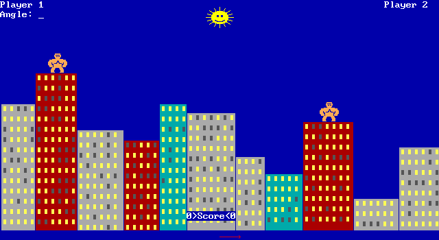
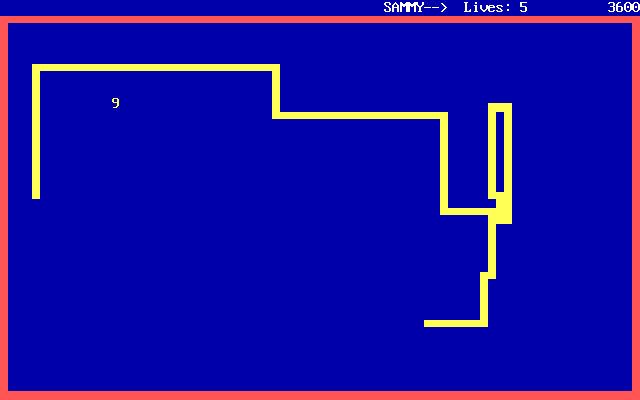
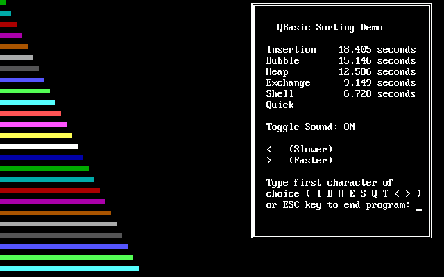

<div align="center">
  
  <br/>
  

  <p><b>A purist, zero-dependency Universal Interpreter & Just-In-Time (JIT) compiler.</b></p>

  <p>
    
    
    
    
  </p>
</div>

---

Built entirely in pure JavaScript (ES6), Sysclone is designed to run directly in the browser. It features a full split-screen Web IDE, real-time Virtual CPU controls, and pixel-perfect hardware emulation.

The ultimate goal of this project is to execute historical and modern programming languages—starting with MS-DOS / QBasic—with absolute fidelity, without modifying the original source code, and without freezing the browser's main thread.

## 🕹️ Live Showcases (Running directly in the Browser)

These classic MS-DOS applications are currently running purely on our JavaScript Universal Interpreter engine. 
Try them live in the WebVM: 

[🦍 Gorilla](#gorilla) | [🐍 Nibbles](#nibbles) | [📊 Sortdemo](#sortdemo)

| Gorilla.bas | Nibbles.bas | Sortdemo.bas |
| :---: | :---: | :---: |
|  |  |  |

## 📖 Documentation

To keep this repository organized, our documentation is split into dedicated files. Please explore them to understand the project's vision, inner workings, and future:

* 🎯 **[The Goal & Vision (GOAL.MD)](./docs/GOAL.MD)**: Why this project exists and what it aims to achieve (from Nibbles to Gorillas and Mandelbrot).
* 🏗️ **[Engine Architecture (ARCHITECTURE.MD)](./docs/ARCHITECTURE.MD)**: Deep dive into the Monadic Parsers, Virtual CPU, and Hardware Abstraction Layer.
* 🗺️ **[Project Roadmap (ROADMAP.MD)](./docs/ROADMAP.MD)**: Current progress and what's coming next.
* 📜 **[QBasic Syntax Reference (QBASIC_REFERENCE.MD)](./docs/QBASIC_REFERENCE.MD)**: A strictly derived document from our **Truth Vectors**. It defines the formal behavior of every keyword, ensuring the engine's specifications match historical reality.
* 🤖 **[AI Collaboration Protocol (PROMPT.MD)](./docs/PROMPT.MD)**: The strict engineering standards, language constraints, and metacognition rules governing our Agentic Workflow.

## 🤖 Built with AI Collaboration (Agentic Coding)

This project is developed using a rigorous **Agentic Coding Workflow**, where specialized AI entities collaborate under human supervision. By prioritizing documentation over ephemeral chat memory, this ensures a high-fidelity reconstruction of legacy environments.

### The Methodology

* **Context Resynchronization (Partial or Full Reprompting)**: Every development cycle begins with a synchronization phase using a custom tool. This tool can aggregate the entire codebase or specific sub-modules into a single context stream, ensuring the agent operates with the latest architectural state.
* **Document-Driven Development (DDD)**: All specifications are formalized in Markdown (`GOAL.MD`, `ARCHITECTURE.MD`, `ROADMAP.MD`) before coding and updated after each commit. This exhaustive documentation acts as the **External Working Memory**, allowing any new agent session to resume the project in **Zero-Shot** mode with full technical awareness.
* **Agent Persona & Collaboration**: Each agent session is encouraged to develop a distinct "personality" or specialized role. This creates a more authentic and grounded collaborative experience with the human supervisor, moving away from generic assistance toward true peer-to-peer engineering.
* **Cross-Model Audits**: We utilize a multi-agent approach for validation. Logic designed in one session is audited in another to identify edge cases or compatibility gaps with historical MS-DOS behaviors.

### Quality Harness & Strict Compatibility

* **Truth Vectors Testing (Single Source Of Truth)**: The absolute source of truth resides in `tests/truth_vectors/*.json`. These vectors define the precise inputs, expected outputs, and hardware side-effects of QBasic language.
    * **Historical Confrontation**: They serve to confront the historical knowledge of both human and AI architects against real-world QBasic and MS-DOS behaviors (validated via the DOSBox emulator).
    * **Zero Hallucination**: Agents are prohibited from "guessing" legacy logic. They must consume the Truth Vector to implement or document a feature, ensuring the engine remains a faithful clone, not an approximation.
* **Auto-Documentation**: The `QBASIC_REFERENCE.MD` is dynamically generated from these vectors, providing an always-accurate, verifiable guide for future developments, and preventing hallucinations.
* **Unit Testing Orchestration**: A custom orchestrator (`tests/orchestrator.js`) with recursive auto-discovery dynamically loads suites to validate the engine's core against its agnostic design.
* **Version Control**: Strict use of atomic semantic commits and co-authoring metadata to track the evolution of the AI-human symbiosis.

## 🛠️ Quick Start (Run Locally)

Since this project has **zero external dependencies**, running it is incredibly simple:

1. Clone the repository:
   ```bash
   git clone https://github.com/jfrelat-lab/sysclone.git
   cd sysclone
   ```

2. Start the local dev server (default port 3000):
   ```bash
   npm start
   # or simply run: node server.js
   ```

3. Open your browser and navigate to:
   ```text
   http://localhost:3000
   ```

To run the automated test suite:
```bash
npm test
```

## 🕹️ Using the WebVM

The Sysclone interface is designed as a hybrid between a modern IDE and a vintage hardware controller.

### ⚙️ Virtual CPU Control
* **Clock Speed (MHz)**: Adjust the execution speed in real-time. 
    * *4.00 MHz*: Original IBM PC/XT experience.
    * *20.00 MHz*: Smooth 386/486 era performance.
* **TURBO Mode**: Unlocks the CPU budget, allowing the interpreter to run at the maximum speed supported by your browser's execution thread (ideal for complex algorithms like Quicksort).

### 📺 Hardware-Accurate Display
* **Pixel-Perfect Rendering**: The VGA output uses a strict 640x400 buffer with `image-rendering: pixelated` to maintain crisp MS-DOS aesthetics on high-resolution modern screens.
* **Fullscreen Mode**: Click the expansion icon to immerse yourself in the legacy 4:3 aspect ratio.

### 📹 Integrated Media Studio
* **Instant Screenshot**: Capture the VGA buffer as a PNG file instantly.
* **GIF Recorder**: A built-in high-fidelity recorder. 
    * Captures at **24 FPS** to solve the "stroboscopic effect" of XOR-drawn sprites.
    * Uses a dedicated Web Worker to encode the GIF without freezing the VM execution.

### 💻 Live Source Viewer
* **VS Code Style Gutter**: The editor on the left provides real-time syntax highlighting and line numbering.
* **Deep-Linking**: The UI is synchronized with the URL Hash. Changing the file in the dropdown updates the URL, allowing you to share a specific program state simply by copying the address bar.

## 🧰 CLI Tools (Retro-Computing Utilities)

Sysclone includes built-in tools to help bridge the gap between 1990s MS-DOS and the modern web.

### MS-DOS Code Converter (`convert_bas.js`)
When you copy-paste legacy QBasic code from GitHub or open old `.bas` files in modern editors, the extended ASCII block characters (like the Nibbles snake or UI borders) often turn into garbled "Mojibake" (e.g., `ÛßßÛ` instead of `█▀▀█`).

This CLI tool reads the raw bytes of a legacy file, automatically detects if it's CP437 or Windows-1252 Mojibake, and outputs a pristine, fully compatible UTF-8 file.

```bash
# Convert a legacy or corrupted file to a clean UTF-8 format
# From the project root:
node tools/convert_bas.js ./examples/nibbles.bas ./examples/modern_nibbles.bas
```