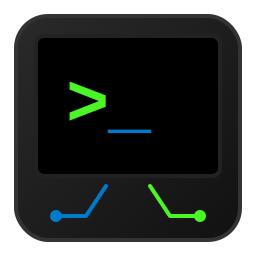

#  Sysclone WebVM 🚀

**A purist, zero-dependency Universal Interpreter & Just-In-Time (JIT) compiler.**

Built entirely in pure JavaScript (ES6), Sysclone is designed to run directly in the browser. It features a full split-screen Web IDE, real-time Virtual CPU controls, and pixel-perfect hardware emulation.

The ultimate goal of this project is to execute historical and modern programming languages—starting with MS-DOS / QBasic—with absolute fidelity, without modifying the original source code, and without freezing the browser's main thread.


-blue)
-yellow)


## 📖 Documentation

To keep this repository organized, our documentation is split into dedicated files. Please explore them to understand the project's vision, inner workings, and future:

* 🎯 **[The Goal & Vision (GOAL.MD)](./docs/GOAL.MD)**: Why this project exists and what it aims to achieve (from Nibbles to Gorillas and Mandelbrot).
* 🏗️ **[Engine Architecture (ARCHITECTURE.MD)](./docs/ARCHITECTURE.MD)**: Deep dive into the Monadic Parsers, Virtual CPU, and Hardware Abstraction Layer.
* 🗺️ **[Project Roadmap (ROADMAP.MD)](./docs/ROADMAP.MD)**: Current progress and what's coming next.
* 🤖 **[AI Collaboration Protocol (PROMPT.MD)](./docs/PROMPT.MD)**: The strict engineering standards, language constraints, and metacognition rules governing our Agentic Workflow.

## 🤖 Built with AI Collaboration (Agentic Workflow)

This project is developed using a rigorous **Agentic Workflow**, where multiple AI models act as specialized engineering departments. This ensures that even though the code is AI-generated, it follows strict architectural constraints and historical accuracy.

### The Methodology

1. **Full Context Reprompting**: Every major development cycle begins with a full-context synchronization using a custom reprompting tool. This tool aggregates the entire codebase and all specification files into a single context stream.
2. **Document-Driven Development (DDD)**: All specifications are formalized in Markdown files (`GOAL.MD`, `ARCHITECTURE.MD`, `ROADMAP.MD`, `PROMPT.MD`) before any code is written. These act as the absolute "Source of Truth" for the agents.
3. **Cross-Model Reviews**: We utilize a "multi-agent" approach for validation. Architecture designed by one model is audited by another to identify potential edge cases or compatibility issues with MS-DOS legacy behaviors.
4. **Quality Harness & CI/CD Ready**: 
    * **Unit Testing**: A custom test orchestrator (`tests/orchestrator.js`) with recursive auto-discovery dynamically loads test suites. It utilizes a lightweight framework (`src/test_runner.js`) to validate every engine component against expected legacy behaviors.
    * **Agnostic Core**: The core parser and runtime are strictly decoupled from any specific syntax. QBasic is simply the first implemented dialect living in its own isolated module.
    * **Version Control (Git)**: Strict use of atomic semantic commits and co-authoring metadata to track the evolution of the AI-human collaboration.
    * **Static Analysis (Planned)**: Integration of strict linting rules to ensure consistency across all AI-generated modules.

### AI Stack & Model Roles

* **Lead Architect & Auditor**: **Gemini 3.1 Pro**. Used for high-level reasoning, complex debugging, cross-module compatibility audits, and architectural planning.
* **Software Engineer**: **Gemini 3.0 Flash**. Used for rapid code generation, unit test writing, and technical documentation updates based on the lead architect's specifications.
* **Legacy Expert**: **Gemini 3.1 Pro**. Specifically tasked with validating the behavior of the Virtual CPU against documented 1990s QBasic and x86 Real Mode behaviors.

Special thanks to the **Gemini** family of models for acting as a tireless co-author and compiler expert.

## 🛠️ Quick Start (Run Locally)

Since this project has **zero external dependencies**, running it is incredibly simple:

1. Clone the repository:
   ```bash
   git clone https://github.com/jfrelat-lab/sysclone.git
   cd sysclone
   ```

2. Start the local dev server (default port 3000):
   ```bash
   npm start
   # or simply run: node server.js
   ```

3. Open your browser and navigate to:
   ```text
   http://localhost:3000
   ```

To run the automated test suite:
```bash
npm test
```

## 🧰 CLI Tools (Retro-Computing Utilities)

Sysclone includes built-in tools to help bridge the gap between 1990s MS-DOS and the modern web.

### MS-DOS Code Converter (`convert_bas.js`)
When you copy-paste legacy QBasic code from GitHub or open old `.bas` files in modern editors, the extended ASCII block characters (like the Nibbles snake or UI borders) often turn into garbled "Mojibake" (e.g., `ÛßßÛ` instead of `█▀▀█`).

This CLI tool reads the raw bytes of a legacy file, automatically detects if it's CP437 or Windows-1252 Mojibake, and outputs a pristine, fully compatible UTF-8 file.

```bash
# Convert a legacy or corrupted file to a clean UTF-8 format
# From the project root:
node tools/convert_bas.js ./examples/nibbles.bas ./examples/modern_nibbles.bas
```